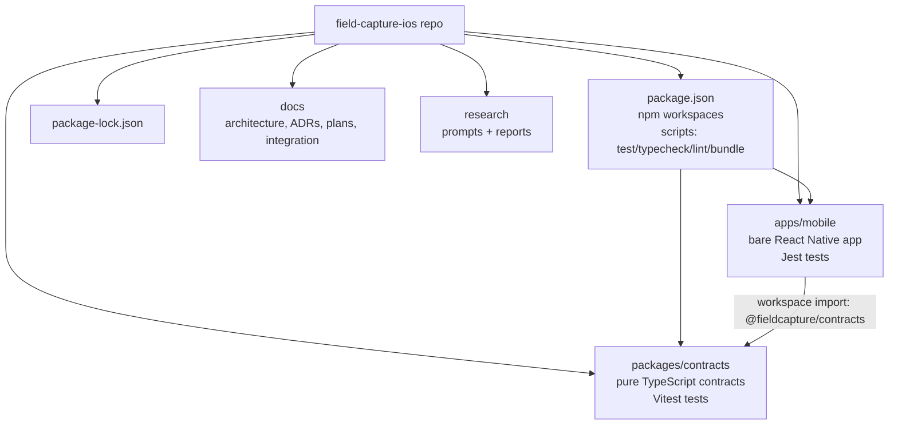
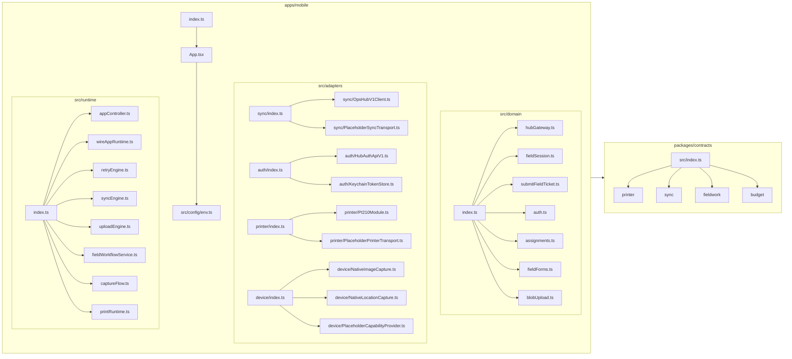

# FieldCapture Repo Graph

Graph view of the repo as it exists now.

## Workspace Graph

```mermaid
flowchart TD
  repo["field-capture-ios repo"]
  rootpkg["package.json<br/>npm workspaces<br/>scripts: test/typecheck/lint/bundle"]
  lock["package-lock.json"]

  mobile["apps/mobile<br/>bare React Native app<br/>Jest tests"]
  contracts["packages/contracts<br/>pure TypeScript contracts<br/>Vitest tests"]
  docs["docs<br/>architecture, ADRs, plans, integration"]
  research["research<br/>prompts + reports"]

  repo --> rootpkg
  repo --> lock
  repo --> mobile
  repo --> contracts
  repo --> docs
  repo --> research

  rootpkg --> mobile
  rootpkg --> contracts
  mobile -- "workspace import: @fieldcapture/contracts" --> contracts
```

## Runtime Source Graph

```mermaid
flowchart LR
  subgraph app["apps/mobile"]
    entry["index.ts"] --> apptsx["App.tsx"]
    apptsx --> env["src/config/env.ts"]

    subgraph domain["src/domain"]
      domain_index["index.ts"] --> gateway["hubGateway.ts"]
      domain_index --> field_session["fieldSession.ts"]
      domain_index --> submit_ticket["submitFieldTicket.ts"]
      domain_index --> auth["auth.ts"]
      domain_index --> assignments["assignments.ts"]
      domain_index --> field_forms["fieldForms.ts"]
      domain_index --> blob_upload["blobUpload.ts"]
    end

    subgraph adapters["src/adapters"]
      sync_index["sync/index.ts"] --> hub_client["sync/OpsHubV1Client.ts"]
      sync_index --> placeholder_sync["sync/PlaceholderSyncTransport.ts"]
      auth_index["auth/index.ts"] --> hub_auth["auth/HubAuthApiV1.ts"]
      auth_index --> token_store["auth/KeychainTokenStore.ts"]
      printer_index["printer/index.ts"] --> pt210["printer/Pt210Module.ts"]
      printer_index --> placeholder_printer["printer/PlaceholderPrinterTransport.ts"]
      device_index["device/index.ts"] --> image_capture["device/NativeImageCapture.ts"]
      device_index --> location_capture["device/NativeLocationCapture.ts"]
      device_index --> placeholder_device["device/PlaceholderCapabilityProvider.ts"]
    end

    subgraph runtime["src/runtime"]
      runtime_index["index.ts"] --> app_controller["appController.ts"]
      runtime_index --> wire["wireAppRuntime.ts"]
      runtime_index --> retry["retryEngine.ts"]
      runtime_index --> sync_engine["syncEngine.ts"]
      runtime_index --> upload["uploadEngine.ts"]
      runtime_index --> workflow["fieldWorkflowService.ts"]
      runtime_index --> capture["captureFlow.ts"]
      runtime_index --> print["printRuntime.ts"]
    end
  end

  subgraph contracts["packages/contracts"]
    contracts_index["src/index.ts"] --> printer["printer"]
    contracts_index --> sync["sync"]
    contracts_index --> fieldwork["fieldwork"]
    contracts_index --> budget["budget"]
  end

  app --> contracts
```
